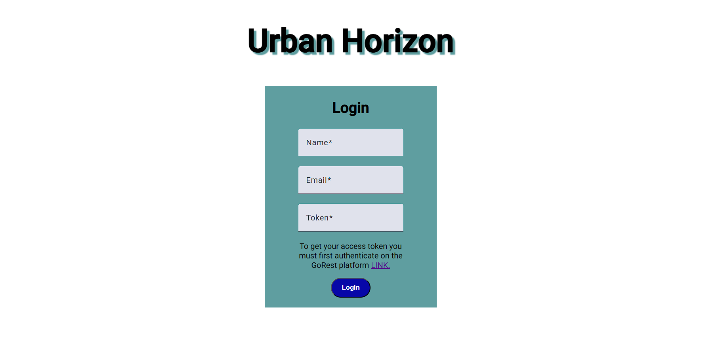

# UrbanHorizon



## About the Project
This application is based on APIs provided by GraphGL and REST API. It allows you to manage users and view or edit their posts.

this application is developed using Angular Framework. Before the authentication, you have to click link and login in GoRest application to copy the token. After having authenticated, you have Home section where you can see the list of users, with the possibility of searching user. It must be possible to create or delete a user.

In this section you can also open a user's profile, where you can see their details, view their posts and then add comments.

You have also Post section where you can see a list of post and post's comments, with the possibility of searching post. It possible to create a post or a comment.


## Getting Started 
### Installation: 
1. Clone repository:
   
   ```bash
   git clone https://github.com/Giangy25/urban-horizon
   ```
2. Navigate to the project directory and open in VSCode:
   
   ```bash
   cd repository-name
   code 
   ```
3. Install dependencies:
   
   ```bash
   npm install
   ```
4. Start development server:
   
   ```bash
   npm serve
   ```
  Navigate to `http://localhost:4200/`. The application will automatically reload if you change any of the source files.

### Code scaffolding

To generate a new component, run: `ng generate component component-name`.

To generate a different type of file, you can also use: `ng generate directives|pipe|service|class|guard|module|interface`.

### Build

To buid the project, run: `ng build`.
This will compile your project and store the build artifacts in the dist/ directory. By default, the production build optimizes your application for performance and speed.

### Running unit tests

To execute unit tests with the [Karma](https://karma-runner.github.io) test runner, run: `ng test`.

### Running end-to-end tests

For end-to-end (e2e) testing, run: `ng e2e`.
Angular CLI does not come with an end-to-end testing framework by default. You can choose one that suits your needs.

## External Services
- [GoRest.co.in](https://gorest.co.in/)

##  Try It!
You can try it here: [Urban Horizon](https://urban-horizon.netlify.app)

## Contact
 [](https://www.instagram.com/angiirosi/)
 [](https://www.linkedin.com/in/angela-rosace-744925291/)
 [](https://github.com/Giangy25?tab=repositories)

